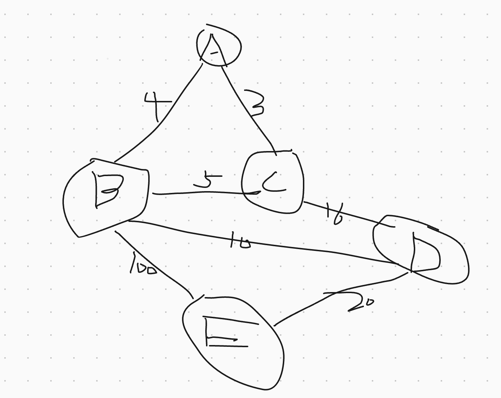

# 图

表达图的方式有很多，针对的算法类型也有很多种。
我们要做的就是固定自己的解题模式，将其他的类型，都转换成我们固有的模型

## 邻接矩阵

如图

可以使用邻接矩阵表示

* oo 代表不相邻 *
-------
|-|A|B|C|D|E|
|A|0|4|3|oo|oo|
|B|4|0|5|10|100|
|C|3|5|0|16|oo|
|D|oo|10|16|0|20|
|E|oo|100|oo|20|0|